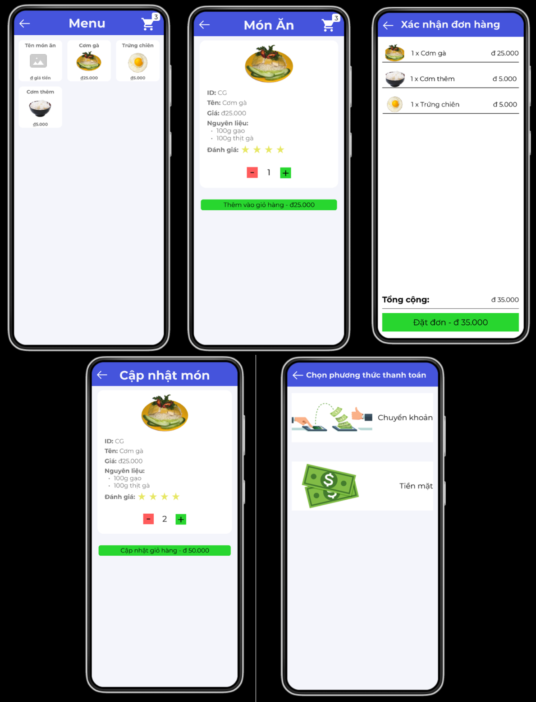

# Course: Introduction to Software Engineering, HCMUS
- This repository contains the final project: CanteenUS.

## Table Of Contents:
- [Course: Introduction to Software Engineering, HCMUS](#course-introduction-to-software-engineering-hcmus)
  - [Table Of Contents:](#table-of-contents)
  - [Group18 members](#group18-members)
  - [Description](#description)
  - [Features](#features)
    - [Admin role:](#admin-role)
    - [Staff role:](#staff-role)
    - [User role:](#user-role)
  - [Project Plan:](#project-plan)
  - [How to run app:](#how-to-run-app)
  - [Demo screenshots:](#demo-screenshots)
    - [Admin role:](#admin-role-1)
    - [Staff role:](#staff-role-1)
    - [User role:](#user-role-1)

## Group18 members
| Student ID | Name                   |Email                            |
|------------|------------------------|---------------------------------|
| 21120542   | Lâm Hoàng Quốc         | 21120542@student.hcmus.edu.vn   |
| 21120569   | Phạm Đình Tiến         | 21120569@student.hcmus.edu.vn   |
| 21120572   | Trần Đình Nhật Trí     | 21120572@student.hcmus.edu.vn   |
| 21120585   | Lê Anh Tú              | 21120585@student.hcmus.edu.vn   |
| 21120588   | Nguyễn Phước Anh Tuấn  | 21120588@student.hcmus.edu.vn   |


## Description
- This is an application allowing users to management canteen, order food on their Android smartphones.
- There are 3 roles for users: Admin, Staff, Customer.
- We split backend and mobile into two 2 folder

## Features
- Chat realtime
- Managing user's profile
### Admin role:
- Managing the staff
- Managing the storage
- Managing the business target
- Managing the menu
- Calculating the profit of month or year
- Preview the bills of canteen
### Staff role:
- Order food
- Preview the bills of canteen
### User role:
- Order food
- Preview the bills of canteen
- Feedback the quality of food

## Project Plan:
- Trello - Project management:
```
    https://trello.com/b/GotLUDFk/canteen
```
- Prototype:
```
    https://www.figma.com/file/BbTxBa8R50JFowNCNyg2b6/Intro-to-SE---Canteen?type=design&node-id=192-1531&mode=design&t=RKVRvlrzfuNklCsd-0
```

## How to run app:
1. You need to install Visual Studio Code, MySQL Server - WorkBench and at least two Android Virtual Devices (AVDs), clone resposity to your device:
```
  git clone https://github.com/cheesepp/CANTEENUS_App.git
```
2. Running the AVD, you MUST change to folder 'backend', initial project with 'npm init -y', implement dependency in file '/backend/package.json', using command line 'npm i <module_name>'
3. The next, open the second terminal, you change to folder 'mobile', initial project with 'npm init -y', implement dependency in file '/mobile/package.json', using command line 'npm i <module_name>'
4. You should config MySQL connection like file 'backend/.env':
+ DB_HOST=127.0.0.1
+ DB_USER=root
+ DB_PASSWORD=123456
+ DB_NAME=canteenus
5. You need to create a database name 'canteenus'
6. In the first terminal, run backend with command line 'npm start', it will auto create many necessary tables in database canteenus,
run the script in source folder to insert mock data
7. Finally, in the second terminal, run mobile with command line 'npx react-native run-android', you completely run the app.

## Demo screenshots:
- Chat realtime
 

- Managing user's profile


### Admin role:
- Managing the staff


- Managing the storage


- Managing the business target


- Managing the menu


- Calculating the profit of month or year


- Preview the bills of canteen


### Staff role:
- Order food


- Preview the bills of canteen


### User role:
- Order food


- Preview the bills of canteen


- Feedback the quality of food


***
__Thank you for reading!__